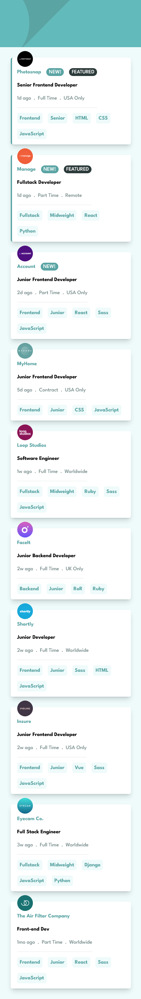
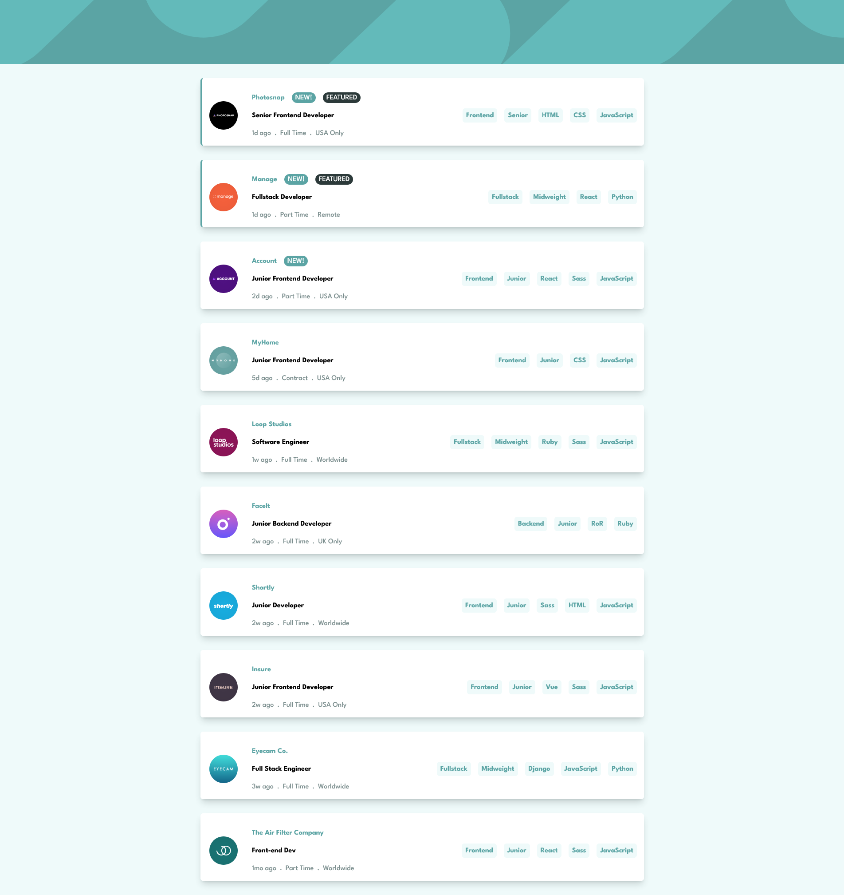

# Frontend Mentor - Job listings with filtering solution

This is a solution to the [Job listings with filtering challenge on Frontend Mentor](https://www.frontendmentor.io/challenges/job-listings-with-filtering-ivstIPCt). Frontend Mentor challenges help you improve your coding skills by building realistic projects.

## Table of contents

- [Overview](#overview)
  - [The challenge](#the-challenge)
  - [Screenshot](#screenshot)
  - [Links](#links)
- [My process](#my-process)
  - [Built with](#built-with)

## Overview

### The challenge

Users should be able to:

- View the optimal layout for the site depending on their device's screen size
- See hover states for all interactive elements on the page
- Filter job listings based on the categories

### Screenshot

### Links

- Live Site URL: [Solution](https://piojosistematico.github.io/fem-static-job-listings/)

## My process

### Built with

- Semantic HTML5 markup
- Tailwind CSS
- Mobile-first workflow
- React + Typescript
- React Aria Components
- React Hook Form and Zod

### React + Typescript Front-End Master Series (Intermediate and Advanced Challenges)

If you are interested check out the other projects of the front end master challenges that i solved with react + typescript (trying to learn both)

- [fem-bookmark-landing-page](https://github.com/PiojoSistematico/fem-bookmark-landing-page/)
- [fem-calculator-app](https://github.com/PiojoSistematico/fem-calculator-app/)
- [fem-chat-app-css-illustration](https://github.com/PiojoSistematico/fem-chat-app-css-illustration/)
- [fem-easybank-landing-page](https://github.com/PiojoSistematico/fem-easybank-landing-page/)
- [fem-ecommerce-product-page](https://github.com/PiojoSistematico/fem-ecommerce-product-page/)
- [fem-interactive-comments-section](https://github.com/PiojoSistematico/fem-interactive-comments-section/)
- [fem-launch-countdown-timer](https://github.com/PiojoSistematico/fem-launch-countdown-timer/)
- [fem-manage-landing-page](https://github.com/PiojoSistematico/fem-manage-landing-page/)
- [fem-room-homepage](https://github.com/PiojoSistematico/fem-room-homepage/)
- [fem-static-job-listings](https://github.com/PiojoSistematico/fem-static-job-listings/)
- [fem-todo-app](https://github.com/PiojoSistematico/fem-todo-app/)
- [fem-url-shortening-api](https://github.com/PiojoSistematico/fem-url-shortening-api/)
- [fem-rock-paper-scissors](https://github.com/PiojoSistematico/fem-rock-paper-scissors/)
- [fem-rest-countries-api](https://github.com/PiojoSistematico/fem-rest-countries-api/)

### Feedback

Any feedback is welcome.
